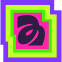

# Zirui Zhao

**A design engineering portfolio you can throw things around in.**

My portfolio brings together graphic design, code, and a slightly unreasonable amount of attention to how things move. Letterforms fall into the homepage, colors travel between pages, artwork lives in an infinite field, and six photos become a cube you can turn in your hands.

The visual language is simple: black type, white space, thin borders, and loud, layered shapes. The interaction is where it gets weird.

## The fun stuff

### Typography with weight

The five SVG letter sculptures on the homepage are physical objects. They spawn in midair over a one-second stagger, fall under gravity, collide, and respond to dragging and throwing. Matter.js gives them mass, friction, and low restitution so they feel heavy when they land.

Three of those shapes are also navigation:

- **Z → Work**
- **R → Playground**
- **Cursive I → About**

Hovering pulls the inner layers partway inward, widening the outside color while keeping the glyph and every layer visible. Other shapes recede, a destination label appears, and a matching gradient spreads down from beneath the navigation bar. Clicking carries that exact color into the next page’s cursor, highlights, and transition.

### A tunnel of color

A centered circle grows from almost nothing into a rush of nested color bands. The original 1.05-second GSAP sequence starts slowly and accelerates sharply with a twelfth-power easing curve. Uneven layer widths give the tunnel depth, and its white core expands far enough to cover every viewport corner before the homepage appears.

The introduction completes automatically. The navigation bar glides in, sculptures arrive in a stagger, and the name and subtitles follow with a gentle reveal. Reduced-motion users bypass the tunnel; Escape and a keyboard-focusable skip link also lead straight into the site. UW links directly to the University of Waterloo.

### Color that keeps changing

Each refresh generates new shape palettes from curated color families: electric blues, violets, coral, mint, pale yellow, and deep tinted inks. Neighboring layers are chosen for luminance separation as well as color, keeping the silhouettes readable.

The circles are interactive too. Click one and fresh colors expand from its core, replacing the old palette. Every layer stays opaque and inside the original circle, so the animation reads as a solid object changing from within.

Regular page transitions generate a new accent hue at a fixed OKLCH lightness. Shape-led transitions inherit the shape’s outside color instead.

### A playground with no edge

The Playground scatters 25 illustrations, posters, sketches, and product concepts across a field of layered circles. Scroll, drag, or use the arrow keys to explore in any direction. Images open in a lightbox when clicked.

The canvas wraps around its artwork bounds. Its camera and target positions are normalized together, keeping navigation continuous even after long pans. Artwork and the dotted background share the same eased cursor offset, so the parallax moves the whole scene together.

### A work page with room to breathe

Work opens straight onto the case studies. Each square-cornered card plays its project's cover reel, and the cards alternate wide and narrow across a twelve-column grid. Below them, a masonry grid of visual work mixes the ArtsFest poster with pieces from the playground; posters rest on a mat instead of being cropped, and items fill the shortest column so the columns end close together. Captions pair the project name in Marr Sans with a line in Marr Sans Condensed. On hover, the image eases back and each piece's small colored glyph turns into an arrow.

### A photo cube you can actually steer

About has six photos mapped onto a cube built from CSS 3D planes. Dragging rotates it around screen-space axes using quaternions, so the direction stays intuitive even when the cube is upside down or facing backward.

Release it for a short inertial glide. On entering About, or after two seconds without interaction, it spins quickly and eases down to a gentle rotation over 2.8 seconds. Arrow keys turn it, Home resets its orientation, and holding Space pauses it.

### Small details that connect it all

Each project opens in a viewer with sticky previous/next controls, a position indicator, and left/right keyboard navigation that loops through all five projects in page order. Playground pieces on the work page open the lightbox and step through just the pieces shown there. Content links and project titles glide letter by letter and draw an underline on hover or keyboard focus. The three experience links have individual hover colors, and top navigation labels stay static. Navigation fills retract toward the top of each button. Arrow icons are inline SVGs, keeping their appearance consistent on phones and tablets without emoji substitution. The custom cursor follows the current accent and compresses on click. Homepage typography responds subtly to the pointer while physical shapes pass through it without distortion.

Contact links stay black and show their platform colors only on hover or keyboard focus. The interface uses a fixed light palette.

## Built to stay responsive

The runtime uses **vanilla JavaScript, GSAP, and Matter.js**, with **Vite** for development and production builds. SVG, CSS transforms, and CSS perspective handle the visuals.

- Physics advances in fixed 120 Hz steps and skips simulation when bodies are settled.
- A containment pass keeps fast throws inside the floor, walls, and ceiling.
- Unchanged artwork transforms avoid repeated DOM writes.
- Text proximity calculations run after pointer changes.
- Playground thumbnails load near the viewport; larger lightbox images load on demand.
- Case study cards play six-second MP4 reels made from each project’s artwork. Reels load as they near the viewport and play only while on screen; they pause behind dialogs, in hidden tabs, and outside Work. Reduced-motion and data-saving preferences keep a first-frame poster.
- Playground pieces on the work page use 800px renditions instead of their 2200px originals.
- PRISM Collective includes its full website walkthrough, three iridescent graphics, and an eight-week timeline.
- Project galleries lazy-load their images; the walkthrough loads when requested.
- Cube animation stops offscreen, outside About, and when the document is hidden.

Reduced-motion preferences skip the intro and disable automatic cube rotation. Keyboard navigation, visible link focus states, Escape-to-close dialogs, and lightbox focus return are part of the experience too.

## UW CS webring

The existing lion and arrow icons in the top-right navigation implement the [UW CS webring widget](https://github.com/JusGu/uwatering#widget-template). The lion opens the directory; the arrows request the previous or next member relative to `https://www.zirui.ca/`. Their artwork, dimensions, and hover behavior stay the same.

The widget is ready on this site. Directory membership is managed separately through a pull request to the webring repository; the domain must be listed there for neighboring-site navigation to resolve.

## Run locally

```sh
npm install
npm run dev
```

```sh
npm run build    # Generate the production site in dist/
npm run preview  # Preview the production build
npm test         # Run the physics, color, wrapping, rotation, and work layout tests
```

Both `/` and `/testi-physics.html` serve the portfolio. Keep their HTML markup synchronized when editing. Serve the site over HTTP rather than opening the HTML directly.

## Inside the code

| File | What it handles |
| --- | --- |
| `src/main.js` | Navigation, intro choreography, typography, and the project viewer |
| `src/work.js` + `src/work-layout.js` | Work feature grid and visual masonry |
| `src/physics.js` + `src/enclosure.js` | Physical sculptures, boundaries, dragging, and circle animations |
| `src/palette.js` | Curated random palettes with contrast between layers |
| `src/looping-canvas.js` | Two-axis panning, wrapping, and artwork placement |
| `src/playground-gallery.js` | Image lightbox and gallery navigation |
| `src/about-cube.js` + `src/cube-math.js` | Photo cube, quaternion rotation, inertia, and idle motion |
| `src/projects.js` | Project descriptions, card captions, metadata, galleries, and the visual grid selection |
| `src/style.css` | Layout, Marr typography, responsive styles, and interaction states |

The tests exercise real Matter.js collisions and extreme throws at mobile and desktop dimensions, along with palette contrast, canvas wrapping, and rotation invariants. The cube tests specifically check that dragging moves the facing surface in the same direction on both the front and back, and that thousands of rotations do not introduce scale drift. The work layout tests check that feature rows alternate spans and that the masonry keeps reading order while balancing its columns.

### Regenerating project covers

Run `python3 scripts/generate-project-covers.py` with FFmpeg installed to regenerate the five cover videos. These are pre-rendered H.264 loops, so the browser does not need to composite the motion effects at runtime.

### Regenerating grid images

Run `python3 scripts/generate-grid-images.py` with FFmpeg and cwebp (libwebp) installed to rebuild the work page's grid-sized WebP renditions and the first-frame posters for the cover videos. Run it again after regenerating the covers. It covers every playground image, so any of them can join the visual grid in `src/projects.js`.
